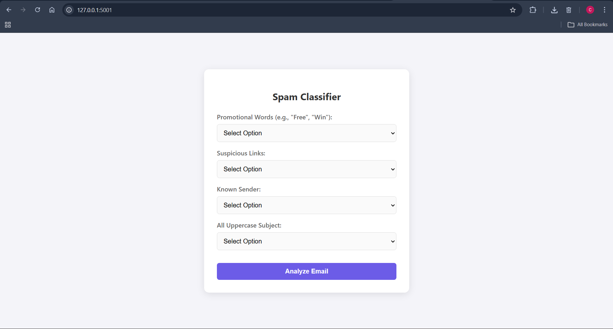

# Concept Learning — Spam Email Classifier

## Overview

This project demonstrates a simple spam email classification system using Concept Learning. The system learns patterns from training data and predicts whether an email is Spam or Not Spam.

## Learning Method

The Find-S algorithm is used to learn a hypothesis from positive examples (Spam emails). It identifies important features such as promotional words, suspicious links, sender status, and use of capital letters.

## Learned Rule

- Promotional Words = Yes
- Known Sender = No
- All Caps = Yes
- Suspicious Links = Any

```bash
PS D:\ML_Assignment_1\ques1> python app.py
 * Serving Flask app 'app'
 * Debug mode: on
WARNING: This is a development server. Do not use it in a production deployment. Use a production WSGI server instead.
 * Running on all addresses (0.0.0.0)
 * Running on http://127.0.0.1:5001
Press CTRL+C to quit
 * Restarting with stat
 * Debugger is active!
 * Debugger PIN: 784-836-866
```

## System Output

The web interface allows users to select email features and predicts the result. For example, the system classified the test input as:



**Result: Spam**

## Conclusion

The project shows how concept learning can be used to build a simple spam detection system that learns from examples and makes predictions.
